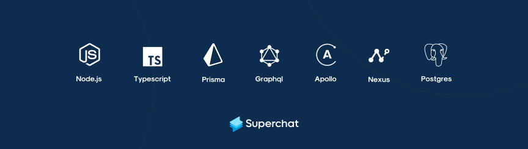

<div align="center">

  
  

</div>


<div align="center">

# **💬 Superchat Backend Challenge**

</div>
  
This challenge is mocking real-life scenario of a simple service replicating the core functionalities of a communications platform. 


<br>


## **🪄 Features**
Users should be able to do the following:

- [x] Create contacts given their personal information (Name, E-Mail, etc) #6
- [x] List all contacts #2
- [x] Send a message to a contact #9
- [x] List all previous conversations #5
- [x] Get contact with a given email #7
- [ ] Substituting `messageContent` value when calling `sendMessage`, `reciecveMessage` mutations
  - [ ] Building Bitcoin utility class to get Bitcoin's latest price
  - [ ] Adding support to [name, bitcoin] placeholders in `messageContent` request field
  - [ ] replacing [`name`, `bitcoin`] placeholders on request with the `contact.name` and `BitcoinData.getPrice()` result
- [ ] Receive messages from an external service via a webhook
  
  ---

🔴 This implementation doesn't support:

- Treads in messages
- Channels (everything is assumed to be a DM)
- Group messages (no concept of a channel)


<br>

## **💫 Implementation**

The result of this implementation is [GraphQL](https://graphql.org/) [Apollo server](https://www.apollographql.com/docs/apollo-server/#:~:text=Apollo%20Server%20is%20an%20open,use%20data%20from%20any%20source.) that relies on [Nexus Schema](https://nexusjs.org) to code-first generate its schema and make it type-safe to efficiently use it in TypeScript, and the ORM of choice was [Prisma](https://www.prisma.io/) which is interacting with Postgres instance that is running on Docker.

<br>

## **🧱 Tech Stack**
To build this service i used following tech stack





## **🚀 Development Server Setup** 

Run the following commands to start a development server:

1. Run `yarn` to install the dependencies;

2. `yarn docker:up` To build a docker Postgres instance and build the database locally;

3. `yarn prisma:migrate` To migrate the database;

4. `yarn prisma:generate` To generate the client;

5. `yarn nexus:watch` In another terminal tab, to generate a GraphQL type file in `node_modules/@types/nexus-typegen/index.d.ts` and a GraphQL schema file called `schema.graphql`. Do NOT edit these files;

5. `yarn dev` In another terminal tab, to start the server on port 5000. Optionally override the port in .env;

6. `yarn data:seed` To create some seed data.

You can now visit `http://localhost:5000/graphql` for the playground.

<br>

## **🧪 Testing & CI Pieplines**

> All tests run in CI on pull request events


Different options are available for testing the server, you can run:

- `yarn test:watch` To run API integration tests in watch mode while writing them;

- `yarn test:api` To run API integration tests;

- `yarn test:api -u` To update API integration test snapshots.

<br>


## **🗂 Types, Queries, and Mutations** 

Data Types, Queries, and Mutations are defined in the `./graphql/types/` folder. Since i used a code-first approach, everything is defined with the nexus  library using `objectType` and `extendType`.

## **Types**


#### Data Types

Data Types represent the models defined in the `schema.prisma` file.

Defining the corresponding GraphQL Object Types, which contain identical informations that i have defined in our database schema


`[Contact, Message]`


<br>


## **Queries**

All the mentioned inputs that are optional have `?` sign


| Name  | Description | Input | 
|--------|----|---|
| listContacts | List all contacts | N/A | 
| findContact | Find a Contact given their email | `email` String|
| listPreviousMessages | List all previous conversations between contact [one, two] | `one` String, `two` String, |

<br>

**List contacts**:

<details>
<summary>List all contacts (Query, Variables, Response)</summary>

<br>

Query:

```graphql
query ListContacts {
  listContacts {
    id
    name
    email
    createdAt
    updatedAt
  }
}
```

Variables:

```json

N/A

```

Response:  ✅

```json
{
  "data": {
    "listContacts": [
      {
        "id": "ckwdfh71d0000t5hfrman1lvo",
        "name": "Humam Abo Alraja",
        "email": "humam@company.com",
        "createdAt": "1637752373473",
        "updatedAt": "1637752373474"
      },
      {
        "id": "ckwdfh72i0007t5hfsz5pncq2",
        "name": "John",
        "email": "john@company.com",
        "createdAt": "1637752373514",
        "updatedAt": "1637752373515"
      },
      {
        "id": "ckwdfh74e0014t5hfv8sf5lfe",
        "name": "Emma Mockassin",
        "email": "emma@company.com",
        "createdAt": "1637752373582",
        "updatedAt": "1637752373583"
      },
      {
        "id": "ckwdfh76r0021t5hfxy22j582",
        "name": "Alex Smith",
        "email": "alex@company.com",
        "createdAt": "1637752373667",
        "updatedAt": "1637752373668"
      }
    ]
  }
}
```

</details>

<br>


**Find Contact**:

<details>
<summary>Find a Contact given their email (Query, Variables, Response)</summary>

<br>

Query:

```graphql
query FindContact($email: String) {
  findContact(email: $email) {
    id
    name
    email
    createdAt
    updatedAt
  }
}
```

Variables:

```json

{
  "email": "emma@company.com"
}

```

Response:  ✅

```json
{
  "data": {
    "findContact": {
      "id": "ckwdfh74e0014t5hfv8sf5lfe",
      "name": "Emma Mockassin",
      "email": "emma@company.com",
      "createdAt": "1637752373582",
      "updatedAt": "1637752373583"
    }
  }
}
```

</details>

<br>


**List previous messages**:

<details>
<summary>List all previous conversations between contact [one, two] contacts (Query, Variables, Response)</summary>

<br>

TODO:
- [ ] Fetching both ID's data

Query:

```graphql
query ListPreviousMessages($one: String, $two: String) {
  listPreviousMessages(one: $one, two: $two) {
    id
    messageContent
    senderId
    recieverId
    createdAt
    updatedAt
  }
}
```

Variables:

```json

{
  "one": "ckwdfh72i0007t5hfsz5pncq2",
  "two": "ckwdfh74e0014t5hfv8sf5lfe"
}

```

Response:  ✅

```json
{
  "data": {
    "listPreviousMessages": [
      {
        "id": "ckwdk3rth0015k0hfhwjmwmfx",
        "messageContent": "Hey Ema!",
        "senderId": "ckwdfh72i0007t5hfsz5pncq2",
        "recieverId": "ckwdfh74e0014t5hfv8sf5lfe",
        "createdAt": "1637760145301",
        "updatedAt": "1637760145302"
      },
      {
        "id": "ckwdk3vjm0024k0hfjwf2g12k",
        "messageContent": ", do you mind sending me the pitch ASAP? Thanks in advance!",
        "senderId": "ckwdfh72i0007t5hfsz5pncq2",
        "recieverId": "ckwdfh74e0014t5hfv8sf5lfe",
        "createdAt": "1637760150130",
        "updatedAt": "1637760150131"
      }
    ]
  }
}
```

</details>

<br>


## **Mutations**

Mutation are used to perform operation on our GraphQL resources

> Input types aren't listed in this table, you can find them in teh Apollo Sanbox

| Name  | Description |
|--------|----|
| addContact | Add an contact given their name and email |
| UpdateArtwork | Updating an artwork's data | 

  
  <br>

**Add a new contact**:

<details>
<summary>Add a new contact (Mutation, Variables, Response)</summary>

<br>

Mutation:

```graphql
mutation AddContact($inputType: CreateContactInput) {
  addContact(InputType: $inputType) {
    name
    email
    id
    createdAt
    updatedAt
  }
}
```

Variables:

```json
{
  "inputType": {
    "name": "Humam Abo Alraja",
    "email": "humam@service.com"
  }
}
```

Response: CREATED ✅

```json
{
  "data": {
    "addContact": {
      "id": "ckwdj6zq40002rchfpcloyu51",
      "name": "Humam Abo Alraja",
      "email": "humam@service.com",
      "createdAt": "1637758615900",
      "updatedAt": "1637758615901"
    }
  }
}
```

</details>

<br>


**Send a message to a contact**:

<details>
<summary>Send a message to a contact  (Mutation, Variables, Response)</summary>

<br>

TODO:
  - [ ] Building Bitcoing API interface
  - [ ] Mapping through `messageContent` and substituting name & price value

Mutation:

```graphql
mutation AddContact($inputType: SendMessageInput) {
  sendMessage(InputType: $inputType) {
    id
    senderId
    recieverId
    messageContent
    createdAt
    updatedAt
  }
}
```

Variables:

```json
{
  "inputType": {
    "name": "Humam Abo Alraja",
    "email": "humam@service.com"
  }
}
```

Response: CREATED ✅

```json
{
  "data": {
    "sendMessage": {
      "id": "ckwdjfr220031rchfmouabh0a",
      "senderId": "ckwdfh76r0021t5hfxy22j582",
      "recieverId": "ckwdfh74e0014t5hfv8sf5lfe",
      "messageContent": "Hey Emma!",
      "createdAt": "1637759024570",
      "updatedAt": "1637759024571"
    }
  }
}
```

</details>

<br>


## **💽 Database Schema model**

The challenge's database is implemented in naive approach due to some time constraints, and we can exponentially improve it by Nomralizing the relationship between the messages and contacts.

<br>

<div align="center">


  

</div>

---


<div align="center">🎉 Thanks for reading </div>
